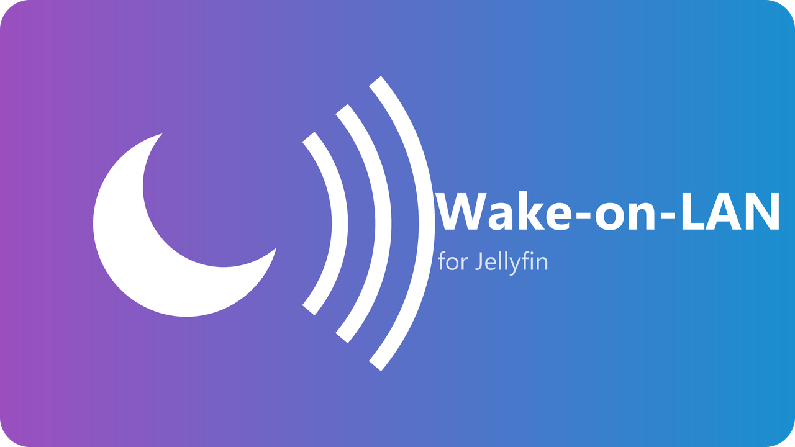

<p align="center">
  
</p>

<h1 align="center">Wake-on-LAN for Jellyfin</h1>

<p align="center">
  <a href="https://github.com/YcKe/jellyfin-plugin-wakeonlan/actions/workflows/ci.yml"></a>
  <a href="https://github.com/YcKe/jellyfin-plugin-wakeonlan/releases/latest"></a>
  <a href="LICENSE"></a>
  
</p>

Keep your media on a NAS that sleeps when nobody is watching, without anyone noticing.
This plugin sends a Wake-on-LAN magic packet to your storage server the moment a client
connects to Jellyfin or starts playback, so the disks are spinning by the time a file is
requested.

## Features

- **Wakes on demand.** Triggers when a session starts and when playback begins.
- **Skips the packet when it is not needed.** Optionally probes a TCP port first and stays quiet if the server already answers.
- **Cooldown.** A configurable minimum interval between wake attempts keeps the network quiet when many clients connect at once.
- **Diagnostics built in.** The settings page can check whether the server is reachable and send a test packet without saving.
- **Any MAC notation.** `AA:BB:CC:DD:EE:FF`, `AA-BB-CC-DD-EE-FF`, `AABB.CCDD.EEFF` and `AABBCCDDEEFF` all work.
- **Administrator only.** The test and status endpoints require an elevated Jellyfin session.

## Requirements

- Jellyfin **12.0** or newer.
- A storage server with Wake-on-LAN enabled in its BIOS or UEFI firmware **and** in the network adapter settings of its operating system.
- Jellyfin and the storage server on the **same layer 2 network** (same subnet or VLAN). Magic packets are broadcast frames and do not cross routers.
- If Jellyfin runs in Docker, the container needs `network_mode: host` (or a macvlan network). The default bridge network cannot broadcast to your LAN.

## Installation

### From the plugin repository (recommended)

1. In Jellyfin open **Dashboard > Plugins > Repositories** and click **+**.
2. Enter any name and this URL:

   ```
   https://raw.githubusercontent.com/YcKe/jellyfin-plugin-wakeonlan/main/manifest.json
   ```

3. Go to **Catalog**, open **Wake-on-LAN**, and click **Install**.
4. Restart Jellyfin when prompted.

### Manual

1. Download `wake-on-lan_<version>.zip` from the [latest release](https://github.com/YcKe/jellyfin-plugin-wakeonlan/releases/latest).
2. Extract it into a new folder under your Jellyfin `plugins` directory, for example `plugins/WakeOnLan_1.0.0.0/`.
3. Restart Jellyfin.

## Configuration

Open **Dashboard > Plugins > Wake-on-LAN**.

| Setting | Default | What it does |
| --- | --- | --- |
| MAC address | | Hardware address of the storage server's network adapter. Required. |
| IP address or host name | | Where to probe before sending. Leave empty to always send a packet. |
| Probe port (TCP) | `445` | A port the server listens on when awake. `445` for SMB, `2049` for NFS, `22` for SSH. |
| Magic packet port (UDP) | `9` | Port the packet is broadcast to. Almost always `9`, some devices expect `7`. |
| Cooldown (seconds) | `600` | Minimum time between two probes or packets. |

Use **Check server** to confirm the probe settings and **Send test packet** to confirm the
server actually wakes. Both work on the values in the form, so you can experiment before saving.

## How it works

1. Jellyfin raises an event when a client session starts or playback begins.
2. If the cooldown has elapsed, the plugin tries to open a TCP connection to the configured IP and port with a two-second timeout.
3. If the connection succeeds, nothing is sent. If it fails, or no IP is configured, a standard 102-byte magic packet is broadcast to `255.255.255.255` on the configured UDP port.
4. The cooldown timer restarts.

Everything runs on a background thread, so playback and session handling in Jellyfin are never delayed.

## Troubleshooting

- **The test packet is sent but the server does not wake.** Check that Wake-on-LAN is enabled in both firmware and the OS network adapter. Some adapters only wake from S3 sleep, not from a full shutdown. Some need "Wake on magic packet" enabled explicitly in the driver.
- **"Offline" even though the server is up.** Make sure the probe port really is open, and that the server's firewall allows connections from the Jellyfin host.
- **Nothing happens in Docker.** Switch the container to host networking. Bridge networks cannot send broadcast frames to the LAN.
- **Where are the logs?** Every action is logged with the prefix `WOL Plugin:` in the Jellyfin server log.

## Development

```bash
dotnet build
dotnet test
```

The project builds with warnings as errors and the analyzer set used by official Jellyfin
plugins, see `jellyfin.ruleset`.

To regenerate the logo PNGs from the SVG geometry:

```bash
pip install pillow
python tools/make_logo.py
```

### Releasing

1. Update `version` in `build.yaml` and add an entry to `CHANGELOG.md`.
2. Commit, then tag and push: `git tag v1.0.0.0 && git push origin main v1.0.0.0`.
3. The release workflow runs the tests, packages the plugin with [jprm](https://github.com/oddstr13/jellyfin-plugin-repository-manager), publishes a GitHub release, and updates `manifest.json` on `main`.

## License

[MIT](LICENSE)
